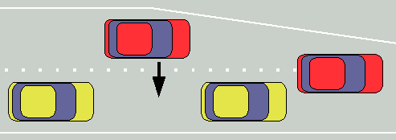
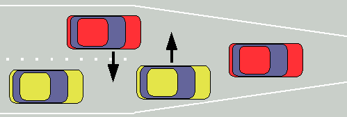
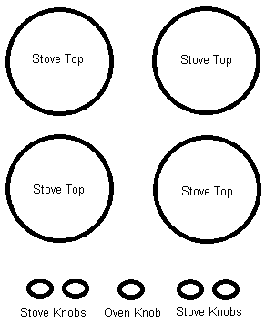
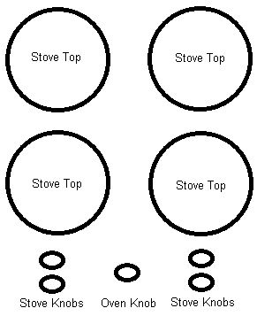

# Better Standards

A lot of standards aren't the best, but people follow them anyway because it's too costly to switch.

Arguments against switching to the metric system involve the cost of switching away from US units.

The PAL standard for analog television broadcasting was invented with improvements over NTSC, yet the US never transitioned off NTSC, due to the cost associated with doing so.

---

I like to think about standards, and try and understand:

*Are we following a certain standard because its the best, or out of tradition?*

Over time, I've found a list of standards / policies that we are following out of tradition, and would greatly benefit if we were to switch to a better standard.

Below, I tried to order the standards / policies from what I deem to be most important to least important.

## Voting

**Tradition**: [Plurality Voting](https://en.wikipedia.org/wiki/Plurality_voting)

**Better Standard**: [Approval Voting](https://en.wikipedia.org/wiki/Approval_voting)

According to [Duverger's Law](https://en.wikipedia.org/wiki/Duverger%27s_law), a plurality system marginalizes smaller political parties, generally resulting in a two-party system. 

We should have as many potential political parties as possible.

The more parties there are, the more choices people have.

And more parties, means the amount of bribes (political contributions), will be spread thin on all of the parties.

I feel Approval Voting is better than others. CGP Grey makes a good argument why with his [analogy of finding a place where to eat](https://youtu.be/orybDrUj4vA?t=9).

*Why Approval Voting, not Instant Runoff Voting?*

With approval voting, calculating who won is simple. Just add up all the votes and see who got the most.

With Instant Runoff Voting, the calculation is not simple at all, and just tweaking the calculation a little changes who'd win. [Here's a good video going over that](https://www.youtube.com/watch?v=HoAnYQZrNrQ).

Although Instant Runoff Voting seems to do a good job at stopping the "spoiler" problem, approval voting seems to do it better. You can read more about it [here](https://electology.org/approval-voting-versus-irv).

**Why we haven't switched yet**: Politicians in power, would lose power by diluting it to other parties.

## Taxing

**Tradition**: Sales Tax / VAT, Income Tax, Capital Gains, Property Tax

**Better Standard**: [Georgism](https://en.wikipedia.org/wiki/Georgism), [Land Value Tax](https://en.wikipedia.org/wiki/Land_value_tax)

Most taxes distort economic decisions and suppress beneficial economic activity.

Sales taxes will cause products to cost more, or products to not sell at all.

Georgistic taxes will tax monopolistic assets (Land, electromagnetic spectrum, copyright/patents, domain names), causing owners to use the resource more efficiently. It has positive externalities.

The government should send people a request for payment. People should not need to fill out a tax form declaring how much they'd have to pay. There should be no exceptions for lower tax payment.

**Why we haven't switched yet**: Land would be signficantly cheaper if people had to pay high taxes for its ownership. Current land owners wouldn't like that. And Land owners hold power in government planning.

## Welfare

**Tradition**: Subsidized housing, Government run schools, Minimum wage requirements

**Better Standard**: [Universal Basic Income](https://en.wikipedia.org/wiki/Basic_income)

All citizens should get the same amount of money, regardless of their income.

They should not need to sign up for any program to receive this money. Everyone should be automatically enrolled.

Why they shouldn't need to sign up: The poorest and worst off may be scared, uninformed, and embarrased, to join this program. If everyone just automatically gets the money, it will help these poorest the most.

Giving the money to everyone will stop rich people from saying, "It's not fair, that poor person is getting money, and I am not." Also, giving the money to everyone will make everyone feel as if the government is doing something for them.

The most poor people may have a higher tendency to spend money as soon as they get it. If the money is dispursed monthly, then the day they get it would be considered the "big day" when they get to spend a lump sum. This may make people more likely to *binge spend*.

As a consequence, I know this may be difficult to pull off for a government agency, but it is very important that this money be dispersed *weekly*, or even *daily*. Automatically, electronically. Citizens should get accustomed to the money coming in often. Once they feel safe that the money will be coming in often, I feel that will influence people to binge spend less.

**Why we haven't switched yet**: Fear of some people inappropriately using the money.

## Identification

**Tradition**: ID number written on a card. (Social security number, credit card number, passport number, etc.)

**Better Standard**: Passworded identification. Each ID must have an associated password. No-one should be able to make any changes to a person's record, simply using the ID. A password must be required to verify identity. This password must not be stored by any commercial organization, and must be asked for each time a change needs to be made.

In the United States, some people continue to reject the concept of an Identity Card, preferring to have the ability to remain anonymous. On the federal level, no formal personal form of identification was made. Passports are for traveling outside of the United States. Drivers licenses are for driving. Citizens can live without passports or drivers licenses. As a consequence, (because the US still needs some way to track people, especially for taxation), an informal form of identification (the social security card), became the defacto standard Identity card.

Now the Social Security Number has been used for everything imaginable. From a verification when subscribing to internet service, to recording bankruptcy, loans, and home deeds.

**Why we haven't switched yet**: Adding password protection to the social security card, will mean people will have to admit that it is an Identity Card... Some citizens are not ready to make that change.

## Healthcare Payment

**Tradition**: The place where you work, pays every month to a health insurance company. When you need to go to the doctor, the insurance company pays the doctor.

**Better Standard**: The place where you work should pay every month directly to the employee's doctor, regardless if they are sick or not. Under normal circumstances, the patients should not need to pay anything when visiting their doctor.

In a traditional payment system, a doctor will be payed more if a patient needs to come back to the office multiple times for a reoccuring problem.

If instead the doctor gets payed constantly, regardless if sick or not, it is in the doctor's best interest to keep their patients not sick all the time.

Removing the insurance company greatly simplifies the payment system, bringing down the cost of healthcare.

The employee should be able to choose and switch to any doctor they want, at any time.

Because they're being paid all the time from healthy patients, doctors should be proactively trying to make sure their patents stay healthly, by running various blood tests, perscribing vitamins in advance.

Doctors can do short term personalized drug testing on their healthy patients, to check for side effects. That way if the patents get sick, the doctor will know which drugs they can give didn't have side effects in previous personalized testing.

Short term drugs include: Sleeping Pills, Anohetamines, and Ciprofloxacin.

**Why we haven't switched yet**: Health Insurance companies wouldn't like this, and they hold power in government planning.

## Intellectual Property

**Tradition**: An organization *buys* and *owns* a patent or copyright for a certain amount of time. During this time, no-one can make products that use the intellectual property, without permission or paying royalties to the owner.

**Better Standard**: An organization should only be able to *rent time* for their exclusivity over a patent or copyright. The longer some intellectual property is rented, the more expensive it should become.

Initial rent should be extremely low cost, potentially free, as an incentive for inventers to patent their own works, instead of depending on large organizations.

The increase of rent payment over time should influence intellectual property owners to make use of their patent or copyright instead of just squating on it, waiting for royalties.

If the "ownership" of the intellectual property switches hands, or if there is a gap between rent, the rent will continue to be the same, increasing over time.

**Why we haven't switched yet**: Some powerful organizations own millions of old patents and copyrights. Switching from a ownership model to a rent model would make these organizations pay significantly more. These organizations would not like that, and they hold power in government planning.

## Infrastructure

**Tradition**: After getting government approval, Electric companies, Phone companies, and Internet companies, pay for and lay down and own the transmission lines.

**Better Standard**: Government should lay down and own all transmission lines. Companies should be able to plug into these lines to provide services, competing with each other.

If you have a lot of land, and decide to put up a whole bunch of solar panals or wind wills on there, you shouldn't have a problem simply plugging into the existing electric lines, and have people pay you for the electricity.

Enough competing electric providers allow for resistance against outages.

Switching between two internet companies, shouldn't involve physically changing wires. Multiple internet providers can share the same fiber network.

If internet providers can simply plug into the network and not worry about laying down wire, competition should bring internet prices down.

**Why we haven't switched yet**: Internet Providers prefer to own a monopoly on regions by laying down their own wires. Not enough awareness of alternative.

## Organ Donation

**Tradition**: To donate your organs after death, you have to opt-in to the organ donation program.

**Better Standard**: Everyone should be automatically enrolled to organ donation after death, and should be well informed of this. Everyone should easily be able to opt-out of the program if they wish.

Lots of people die every day because there are not enough organs donated.

Choosing between opting into or out of organ donation is a difficult decision.

Many people choose to simply not choose, and keep the decision as-is.

If the government were to automatically opt-in everyone, there would be a lot more organ donations. Increased organ donations would mean a lot more saved lives.

**Why we haven't switched yet**: Some people don't want the government to mandate any choices by default. Fear that the government will purposely make opting-out too complicated, to stop people from opting out.

## Recycling

**Tradition**: Recycling is a government owned task. Trucks come to collect recyclables from residents for free.

**Better Standard**: Recycling has become profitable. Residents should be paid to recycle.

Amount of profit made per recycle type in the USA:

Recycle Type | Profit per Ton
--- | ---:
Aluminum | $1,325
HDPE plastic | $250
PET plastic | $150
Cardboard | $50
Paper | $5
Glass | -$70

[Source 1](https://www.greenbiz.com/article/yes-recycling-still-good-business-if-happens)
[Source 2](http://kdhnews.com/news/is-recycling-glass-worth-the-cost/article_8e2dd0e6-d956-11e2-ab95-0019bb30f31a.html)

Hence, the government should still provide baseline free and paid recycling service.

But other companies should be able to compete with the government by paying residents to recycle certain things.

Note that curbside pickup, can still be run for free by the government.

Residents should be free to choose which company recycles their things, based on how much they'd be paid.

The government run curbside pickup would send the same weight of recyclables to the company of choice.

Being paid to recycle should overall increase how much people recycle.

Note that the companies should only pay for recyclable things. If someone dumps a bunch of random trash into the recycle bin, they shouldn't expect to get money for it, or even for it to be picked up at all.

If everyone gets paid for recycling, trash companies may become better at removing recyclables from their trash collected, and send them to the recycling companies for some extra income.

**Why we haven't switched yet**: Tradition. Not enough awareness of alternative.

## Road Design

**Tradition**: Square / Rectangular Grid Patterns

**Better Standard**: [Hexagonal](http://web.mit.edu/ebj/www/Hexagonal.pdf)

Ideally with road design, we'd want to minimize the amount of road, and maximize the amount of area that the road gets us to.

A honeycomb hexagonal design maximizes the area, and minimizes the perimeter. Doing this should lower the amount of roads we require, and hence minize road cost.

A purely hexagonal road tilling means that only 3 roads join at an intersection (instead of a usual four way intersection with square grid).

If you chart out all the turns of a four way intersection, there are 16 possible collision points inside.

In a three way intersection, there are only 3 possible collision points inside.

[See example road layouts](hexagon)

**Why we haven't switched yet**: Tradition. Not enough awareness of alternative.

## Radix

**Tradition**: [Decimal](https://en.wikipedia.org/wiki/Decimal)

**Better Standard**: [Heximal](https://github.com/veniamin-ilmer/better-standards/tree/master/base-6)

What is the best radix? - Is a question I thought about for a long time..

e is considered the [most space efficient](https://en.wikipedia.org/wiki/Radix_economy), but is quite inconvenient to use.

Anyway, humans don't seem to need to save more space like machines, for bigger radix numbers.

I think I finally found what I was looking for with base 6, based on how humans naturally use numbers.

**Why we haven't switched yet**: Tradition. Not enough awareness of alternative.

## Timekeeping

**Tradition**: Time varies depending on your geographical position on earth. Time zones and daylight savings time is used.

**Better Standard**: Everyone adapt [Universal Time](https://en.wikipedia.org/wiki/Universal_Time)

Without timezones and daylight savings time, time tracking would be significantly easier.

You'd just have to remember at what time are people awake in different parts of the world.

**Why we haven't switched yet**: Tradition. Not enough awareness of alternative.

## Light Pollution

**Tradition**: Various light designs are used for outside street lighting.

**Better Standard**: All street lights should point straight down to the road. You shouldn't be able to see the source of light from a birds eye view.

[Watch this video for more information](https://www.youtube.com/watch?v=wIC-iGDTU40&feature=youtu.be&t=528)

**Why we haven't switched yet**: Tradition. Not enough awareness of issues with current light designs.

## Merging Lanes

**Tradition**: One lane merges into another lane.

**Better Standard**: Both lanes should merge into a center lane.

[Research has shown](http://www.dot.state.mn.us/trafficeng/workzone/doc/When-latemerge-zipper.pdf), it is safer for people to merge late, rather than merge early. This is called the "zipper method".

However when people see a merge coming up, they usually move to the other lane early on, instead of at the end.

The line ends up longer.

To combat this situation, both lanes should merge into one center lane temporarily.

Here's how it would look like with multiple lanes:

**Why we haven't switch yet**: Not enough awareness.

## Garbage Disposal Control

**Tradition**: Garbage Disposal can be turned on and off using a toggle switch. To turn off the garbage disposal, you have to flick the switch off. Without flipping the switch, the garbage disposal will stay on.

**Better Standard**: The garbage disposal should be controlled by a button switch. Push the button to turn on the garbage disposal. Release the switch to turn off.

It's safer and won't be confused for a light switch.

**Why we haven't switch yet**: Not enough awareness.

## Stove Control Knobs

**Tradition**: All of the knobs are Horizontally aligned.

**Better Standard**: Since there are two stove tops vertically aligned, there should be two knobs vertically aligned.

It'll cause less confusion which knob controls which stove. It'll be safer - People won't accidently burn an empty pot.

**Why we haven't switch yet**: Not enough awareness.

# Theoretically Better Standards

Below are standards that are much too theoretical to be declared as a "better standard", but are interesting to study non-the-less.

## Electrical Utility Frequency

**Tradition**: 50/60 Hz alternating sine wave used by both utility mains, and 50/60 Hz by home devices.

**Better Standard**: ~10 Hz sine wave used by utility mains, and ~400 Hz sine wave used by home devices.

Please [read this article](https://borderlandsciences.org/journal/vol/46/n03-4/Walonick_Effects_6-10hz_ELF_on_Brain_Waves.html) to understand the premise of the ~10 Hz signal.

A ~10 Hz signal can theoretically have an overall positive effect on people's mental abilities.

If that alone is shown to be true, it seems to make sense to switch to that frequency.

Because electric transmission lines are so long, they act as very good antennas for whatever frequency they carry.

However, a 10 Hz signal is difficult to work with electronically. Transformers have to be very large to be able to convert the signal effectively.

~400 Hz is typically used by aircraft, due to the efficiency of small transformers being able to use this frequency.

So I propose, to have large transformers in utility mains, but household should convert the signal to ~400 Hz.

**Why we haven't switch yet**: It's very expensive to convert all 50Hz/60Hz devices to use 400Hz. It's very expensive to convert a mains utility to use 10Hz. We need more testing to see if 10Hz really produces positive mental effects.
