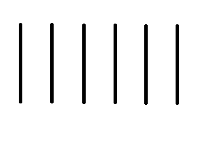
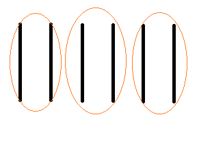
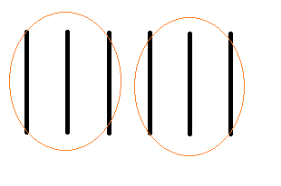

# Heximal

I think our decimal number system, is not the most optimal for our [subitizing](https://en.wikipedia.org/wiki/Subitizing) minds to handle.

Yes, we have 10 fingers, but you can learn to use those fingers to count in different bases.

I think the decimal model has made it more difficult to understand large numbers, and the only reason we hold onto it is out of tradition.

In attempt to understand which base would be better, I did analysis on the *popularity* of numbers.

Presumibly, the popularity of number, should correspond with its order.

Sure, a few numbers can be more favorable to others, considered popular or lucky, but those would be considered anomalies. We'd expect most numbers should continue to be in order.

Why should 10 be more popular than 9?

Why should 100 be more popular than 99?

Why should 1000 be more popular than 999?

My hypothesis is that people will understand numbers better if they were closer to [subitizing limits](https://en.wikipedia.org/wiki/Subitizing).

## Research

I looked up number popularity on [Google Ngram](https://books.google.com/ngrams)

[Here are the results](stats.md)

Notice that 10 appears in the position of the number 6.

Intrigued by this, I wondered if this effect can be seen with other multiples.

And indeed, I found that 10 usually appears close to position 6 in [all multiples that I've tried](stats-multiples.md).

I looked, it even works for [numbers spelled out in english](stats-english.md).

It's as if people naturally want to associate "10" with the sixed number position.

## Interpretation

This was interesting to me, but not the answer I was originally looking for.

Human subitizing limits get up to around the number 4. So I thought base 4 or 5 would be most "natural". Indeed, historically people used [tally marks](https://en.wikipedia.org/wiki/Tally_marks), and those only went up to about 5.

But then I realized two additional factors, that swayed my opinion:

### Subitized Grouping

We are very good at counting in subitized groups. For example how many lines do you see here?:

Most of the time, you're not going to count each stick one at a time.

You usually group the sticks into groups of two or three, and can quickly count each group:

I feel that base 6 helps with counting in such grouped ways.

If 6 were the base, the number of sticks here would be 10. This means you can count:

2, 4, 10, 12, 14, 20, 22, 24, 30, ...

or:

3, 10, 13, 20, 23, 30, 33, 40, 43, ...

With 10s appearing so frequntly, counting by 2 or by 3 feels signficantly easier.

### Finger Counting

With ten fingers on our hands, it is easy to count up to 10.

Various alternative ways of finger counting can be created for counting with other bases, but they usually aren't as simple.

I'd want a way to be able signal a number to a friend from the distance, with no confusion.

And base 6 provides a very simple way to do this.

[View video how to count in base 6](https://www.youtube.com/watch?v=VXw40fzWeu0).

## Conclusion

From my research it sounds like humans are best at working with the heximal number system.

I hence will be trying to promote the heximal number system to others.

I will start by learning the multiplication table in using the heximal base system. I've already [created a quizlet page to start learning](https://quizlet.com/305883769/multiplying-base-6-result-up-to-100-flash-cards/).

As I learn new things about the heximal number system, I will write them here.

If you're interested in learning more, [here is a wiki on base 6](https://en.wikipedia.org/wiki/Senary).

[Here's a page that redefines units of measurements to be in base 6](http://shacktoms.org/base-six/base-six.htm).
