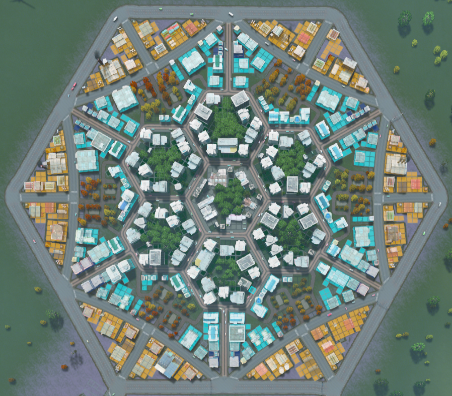
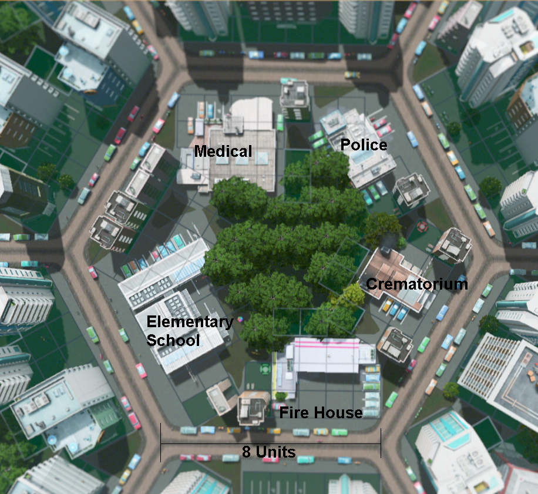
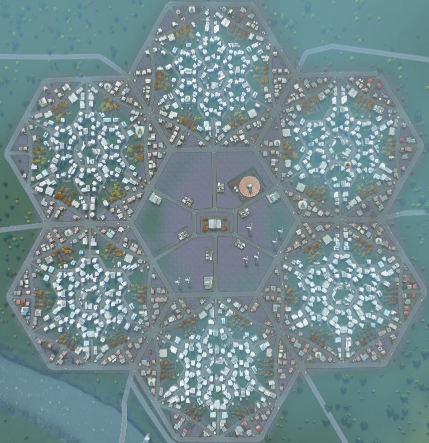

# Hexagon Road Layout

Ideally with road design, we'd want to minimize the amount of road, and maximize the amount of area that the road gets us to.

A honeycomb hexagonal design maximizes the area, and minimizes the perimeter. Doing this should lower the amount of roads we require, and hence minize road cost.

A purely hexagonal road tilling means that only 3 roads join at an intersection (instead of a usual four way intersection with square grid), which would increase the safety of the road.

I've experimented with the idea in the game Cities Skylines.

## Modular Hexagon Roads

Cities Skyline is a game that allows us to build roads with Residential, Commercial, Industrial, and Office zones.

Residential zones prefer a quiet, pollution free area. But they need to be able to work somewhere.

Industrial zones are sources of jobs for many people, but create pollution, and need to be close to the highway for fast product transport.

It's best for industrial zones to be within walking distance to residents, but not too close that they cause polution in the neighborhood.

Although this is not a perfect model, I think this is a relatively good analogy for the real world.

I've hence adapted my hexagonal design ideas to Cities Skylines, and built what I feel is one of the most efficient uses of land.

This design is like a self sustaining *modular* neighborhood. You can place multiple of such neighborhoods right next to eachother.

They are able to sustain themselves with minimal outside needs.

([View Annotated Version](pics/zone_annotated.png))

The inner hexagon contains the shared public services that everyone requires.

Here are the game stats:

The only things that aren't modular are:

* Electrity generation
* Water pumping and disposing
* Garbage Disposal
* Higher Education

The Higher Education especially brings up the expenses, but would be mitigated with more module hexagons.

All of these services are capable of handling multiple of such Hexagons, so they can be offloaded separately.

### Breakdown

The elementary school reaches up to all of the residents, and handles the load of students well - [Education View](pics/education_view.png)

All other entities are within the reach of residental and industrial:

* [Fire View](pics/fire_view.png)
* [Health View](pics/health_view.png)
* [Death View](pics/death_view.png)
* [Crime View](pics/crime_view.png)

Small parks have very low maintenance cost, so I placed them on all sides of the hexagon. Although they turned orange from pollution, residence don't have worse health by visiting them. With so many parks, the [happiness](pics/happiness_view.png), [leisure](pics/leisure_view.png), and [value](pics/value_view.png) are all high.

Finally, and importantly, the [noise](pics/noise_view.png) and [pollution](pics/pollution_view.png) is limited to the industry. And industry has easy access to the highway, since the outer hexagon is all highway.

### Traffic

Here's what the traffic looks like:

No traffic lights.

### Modularity

The best part about this design is the modularity. Each neighborhood is self sustaining, so you can place them right next to eachother and not change anything inside of them, and grow everything that way. Because of the hexagonal highwayed design, there should not be growing pains.

Here's an example:

